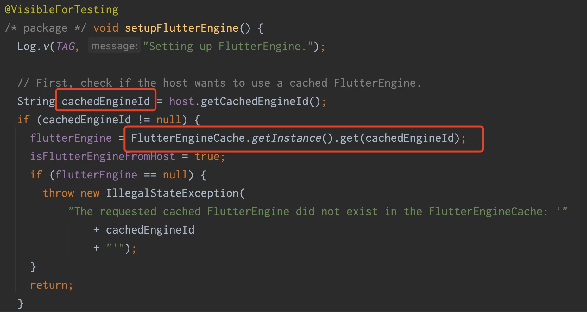

## 前言
随着Google对Flutter的迭代推进和完善，Android、iOS双端的一致性越来越高，开发成本越来越低，也就导致越来越多的应用选择用Flutter开发应用来减少开发资源，
摆在我们面前的就有两个方案选择，一是使用Flutter从0到1重新开发一个App，这样无疑面临着App的开发成本和风险都比较高，尤其是对于一些比较成熟且具有一定规模的App，
这类项目通常都会有一套比较成熟通用的基础库，所以这类App大体的选择就是从Native渐进式的迁移到Flutter，也就是选择Native和Flutter的混合开发，这也是目前比较稳健的一种方式，
由咸鱼的flutter_boost就是针对Native与Flutter混合开发推出的一套解决方案。

今天主要分享的内容包含:
1、FlutterBoos3.0如何解决混合栈问题
2、FlutterBoos3.0t单引擎如何复用
3、FlutterBoost3.0如何实现生命周期的精准通知以及Flutter侧如何实现
4、FlutterBoost3.0常用路由demo
5、结合FlutterBoost3.0，如何与现有路由进行结合
6、结合项目现有痛点进行解决
先看一张图片，有一个整体的思路，然后再跟着这个思路，看下面的细节


## FlutterBoost的接入使用
### Native侧
1、新建一个Native项目
file->new->new project，这里给Native项目命名为FlutterBoostTest

2、新建一个flutter_module
由于Android studio Bumblebee版本不支持通过file->new->new flutter_module，所以我们只能通过cmd命令来创建一个flutte_module。
首先cd到Native项目所在的文件夹，然后执行下面的命令
```
flutter create -t module flutter_module
```
这里需要注意的是，创建的flutter_module需要和native项目是同一目录层级的。

3、Native引入Flutter依赖
3.1在settings.gradle配置如下代码：
```
setBinding(new Binding([gradle: this]))
evaluate(new File(
        settingsDir.parentFile,
        'flutter_module/.android/include_flutter.groovy'
))
include ':flutter_module'
project(':flutter_module').projectDir = new File('../flutter_module')
```
3.2在app下的build.gradle添加flutter相关依赖：
```
implementation project(':flutter')
implementation project(':flutter_boost')
```
3.3在manifest清单文件下的application中添加如下内容：
```
<activity
        android:name="com.idlefish.flutterboost.containers.FlutterBoostActivity"
        android:theme="@style/Theme.AppCompat"
        android:configChanges="orientation|keyboardHidden|keyboard|screenSize|locale|layoutDirection|fontScale|screenLayout|density"
        android:hardwareAccelerated="true"
        android:windowSoftInputMode="adjustResize" >

</activity>
<meta-data android:name="flutterEmbedding"
           android:value="2">
</meta-data>
```
3.4创建一个Application，添加Flutterboost启动流程并设置代理：
```
public class MyApplication extends Application {
    @Override
    public void onCreate() {
        super.onCreate();
        FlutterBoost.instance().setup(this, new FlutterBoostDelegate() {
            @Override
            public void pushNativeRoute(FlutterBoostRouteOptions options) {
                //这里根据options.pageName来判断你想跳转哪个页面，这里简单给一个
                Intent intent = new Intent(FlutterBoost.instance().currentActivity(), TargetActivity.class);
                FlutterBoost.instance().currentActivity().startActivityForResult(intent, options.requestCode());
            }

            @Override
            public void pushFlutterRoute(FlutterBoostRouteOptions options) {
                Intent intent = new FlutterBoostActivity.CachedEngineIntentBuilder(FlutterBoostActivity.class)
                        .backgroundMode(FlutterActivityLaunchConfigs.BackgroundMode.transparent)
                        .destroyEngineWithActivity(false)
                        .uniqueId(options.uniqueId())
                        .url(options.pageName())
                        .urlParams(options.arguments())
                        .build(FlutterBoost.instance().currentActivity());
                FlutterBoost.instance().currentActivity().startActivity(intent);
            }
        }, engine -> {
        });
    }
}
```
至此，Native侧的集成就结束了。
### Flutter侧
1、添加FlutterBoost依赖到yaml文件
在pubspec.yaml配置文件内的dependencies下添加以下依赖
```
flutter_boost:
    git:
      url: 'https://github.com/alibaba/flutter_boost.git'
      ref: 'v3.0-release.2'
```

以上，FlutterBoost的集成就全部结束了。
## FlutterBoost如何解决混合栈问题
### Native做了什么
在我们通过Intent启动一个FlutterBoostActivity，执行FlutterBoostActivity的onResume生命周期方法的时候，
onResume内部会调用一个FlutterBoost.instance().getPlugin().onContainerAppeared(this)方法

在onContainerAppeared就可以看到我们最希望看到的路由操作，pushRoute，我们继续看pushRoute内部做了哪些操作。

pushRoute内部处理了我们最早通过Intent传的一些参数，包含uniqueId、pageName、params，然后通过channel调用pushRoute方法。

在channel调用的pushRoute内部，最终其实就是发送了一个携带params参数、name为dev.flutter.pigeon.FlutterRouterApi.pushRoute的channel到Flutter侧。
### Flutter做了什么
在Flutter侧，我们Main.dart中的根节点build返回了一个FlutterBoostApp。

FlutterBoostApp中主要做了3个处理：
1.注册路由表

2.注册channel
在FlutterBoostApp中的initState初始化了BoostFlutterRouterApi，在BoostFlutterRouterApi中调用FlutterRouterApi.setup()方法，
最重要的就是这个setup方法，在这个方法中我们会发现，FlutterBoost是在Flutter页面初始化的时候，通过setUp方法，注册了一系列的channel，
其中包括路由channel、Flutter页面状态channel等等。

3.push预处理

我们一起来看下onPrePush，在onPrePush内，我们可以根据option.arguments获取push过来的参数，对参数做一些条件判断或者预处理等，
也可以拦截push过来的参数，进行修改，然后再继续执行后续的push流程。
### 总结：
总的来说，FlutterBoost3.0，无论是Native跳转Flutter、Flutter跳转Native、Flutter跳转Flutter，
都是通过channel通信的方式，最终会回到我们Application初始化FLutterBoost的回调方法中。

## FlutterBoost单引擎如何复用
### FlutterBoost1.17.1
```
val intent = MerchantFlutterActivity.withNewEngine().url(url)
            .params(transferEntity.params as Map<String, Any>)
            .backgroundMode(BoostFlutterActivity.BackgroundMode.opaque).build(event.context)
```
以商家版目前使用的FlutterBoost1.17.1版本为例，旧版本的Native跳转Flutter路由为每次打开一个Flutter页面，
都要创建一个新的Engine引擎，创建的api为MerchantFlutterActivity.withNewEngine()，withNewEngine这个静态方法里面返回了一个NewEngineIntentBuilder。

在NewEngineIntentBuilder中配置Flutter的背景模式、url、params参数、上下文，最终通过build方法将params序列化并返回一个intent。

### FlutterBoost3.0
我们在启动app的首先会执行我们的Application，在上文FlutterBoost的接入使用3-3.4中我们可以看到，
在Application中会通过FlutterBoost.instance().setup()来初始化FlutterBoost的相关配置，这其中就包含了初始化Engine这一操作，
具体是怎么做的，我们来一起看下setUp方法中的内容。

setUp方法中，首先会通过getEngine()方法获取一个Engine，如果获取不到Engine，
也就是Engine为null的情况，Flutter提供了一个Provider，我们首先会通过这个Provider获取Engine，如果没有获取到，
那么就new 一个FlutterEngine，并且将这个Engine put到FlutterEngineCache中缓存起来。

我们再来看一下getEngine中做了哪些处理，getEngine中的FlutterEngineCache会通过一个ENGINE_ID来获取一个Engine，这里的ENGINE_ID是一个静态常量，
FlutterEngineCache内部维护了一个cachedEngines是一个Map<String, FlutterEngine>类型的数组，get和put方法通过ENGINE_ID来获取和存储Engine，
那么这个ENGINE_ID是怎么来的呢。
```
Intent intent = new FlutterBoostActivity.CachedEngineIntentBuilder(FlutterBoostActivity.class)
                        .backgroundMode(FlutterActivityLaunchConfigs.BackgroundMode.opaque)
                        .destroyEngineWithActivity(false)
                        .url("mainPage")
                        .urlParams(new HashMap<>())
                        .build(MainActivity.this);
                startActivityForResult(intent, 111);
```
在FlutterBoost3.0中，打开一个新的Flutter页面不再使用withNewEngine，而是使用的CachedEngineIntentBuilder，
两者的区别是，CachedEngineIntentBuilder内部的build方法通过intent传了一个EngineId这个一个参数，并且增加了Flutter页面销毁时，缓存的Engine是否跟随着一起销毁。

上面的build方法执行完成后，继续执行startActivityForResult方法，接着开始执行FlutterBoostActivity生命周期，FlutterBoostActivity继承FlutterActivity，

在FlutterActivity的onCreate中，创建FlutterActivityAndFragmentDelegate实例，调用FlutterActivityAndFragmentDelegate中的onAttach方法，
在onAttach方法中setupFlutterEngine，在setupFlutterEngine其实就是通过我们设置的cachedEngineId来复用Engine，这样，整套Engine的复用就实现了。

### Engine复用总结：
在每次App启动，在Application中会通过setUp中的getEngine来获取Engine，如果获取不到Engine，也就是Engine为null的情况，Flutter就会new 一个FlutterEngine，
并且将这个Engine put到FlutterEngineCache中缓存起来，key为ENGINE_ID，然后在我们启动一个Flutter页面时，
同样是在FlutterEngineCache中通过ENGINE_ID来获取我们存储在Map<String, FlutterEngine>中的Engine，这样就实现的单Engine复用的目的。
FlutterBoost使用的就是单引擎的机制，Flutter2.0 提供了 FlutterEngineGroup，FlutterEngineGroup创建一个新Engine，内存只增加180k，
但FlutterEngineGroup最大的问题是多Engine之间不是isolate层面的内存共享。 从目前看FlutterBoost这种单Engine内存共享的方式还不能被完全取代。
## FlutterBoost提供了哪些能力
这里我们捋一下FlutterBoost提供的使用率比较高的路由能力
### 开启新页面统一Api
```
BoostNavigator.instance.push(
    "yourPage", //required
    withContainer: false, //optional
    arguments: {"key":"value"}, //optional
    opaque: true, //optional,default value is true
);

///or

Navigator.of(context).pushNamed('simplePage', arguments: {'data': _controller.text});
```
### Native跳转Flutter并获取Native参数
Native
```
Map<String, Object> params = new HashMap<>();
        params.put("string","im string params");
        params.put("bool", true);
        params.put("int", 666);
Intent intent = new FlutterBoostActivity.CachedEngineIntentBuilder(FlutterBoostActivity.class)
       .backgroundMode(FlutterActivityLaunchConfigs.BackgroundMode.opaque)
       .destroyEngineWithActivity(false)
       .url("flutterPage")
       .urlParams(params)
       .build(this);
startActivityForResult(intent, REQUEST_CODE);
```
Flutter
```
'flutterPage': (settings, uniqueId) {
      print('flutterPage settings:$settings, uniqueId:$uniqueId');
      return PageRouteBuilder<dynamic>(
        settings: settings,
        pageBuilder: (_, __, ___) => FlutterRouteWidget(
          params: settings.arguments,
          uniqueId: uniqueId,
        ),
      );
    },
```
通过widget.params['key']来获取指定参数
```
  getParams() {
    setState(() {
      paramsText = '${widget.params['string']}';
    });
  }
```
### Flutter跳转Native，并从Native携带参数返回
Flutter跳转Native
```
BoostNavigator.instance.push("native").then(
(value) => print("Return from Native: ${value?.toString()}")),
```
### Native携带参数返回Flutter，重写finish方法
```
    @Override
    public void finish() {
        Intent intent = new Intent();
        intent.putExtra("msg","This message is from Native!!!");
        setResult(Activity.RESULT_OK, intent);  // 返回结果给dart
        super.finish();
    }
```
打印结果

#### Flutter跳转Flutter并处理返回参数
```
// 1. 打开一个Flutter页面，并处理返回结果
InkWell(
child: Container(
    padding: const EdgeInsets.all(8.0),
    margin: const EdgeInsets.all(8.0),
    color: Colors.yellow,
    child: Text(
        'open transparent widget',
        style: TextStyle(fontSize: 22.0, color: Colors.black),
    )),
onTap: () {
    // 如果withContainer为false时，也可以使用原生的Navigator
    final result = await BoostNavigator.instance.push("AFlutterPage",
        withContainer: true, opaque: false);
},
),

// 2. 页面关闭，并返回结果
// 这里也可以使用原生的 Navigator
onTap: () => BoostNavigator.instance.pop({'retval' : 'I am from dart...'}),
```
### Flutter打开H5
```
BoostNavigator.instance.push("webview", withContainer: withContainer)then(
(value) => print('xlog, webview, Return Value:$value')),

child: WebView(
       initialUrl: url,
),
```
### 打开多个页面后回到指定页面
```
BoostNavigator.instance.popUntil(route: "flutterPage");
```
### 支持“打开flutter页面不再打开容器”场景
在很多场景下，Flutter 页面跳转Flutter 页面，这个时候可以不需要再打开容器。不打开容器，能节省内存开销。 在FlutterBoost3.0上，
打开容器和不打开容器的区别表现在用户接口上仅仅是withContainer参数是否为true就好。
解释下打开打开容器和不打开容器的区别：
打开容器，是使用nativeRouterApi.pushFlutterRoute(params)，是通过channel通信，告诉Native侧，再打开一个装载FlutterView的容器，
也就是新创建一个FlutterBoostActivity。不打开容器是通过pushPage，找到当前栈顶的容器，每一个容器内部维护了一个用来放我们Flutter视图的List，
不打开容器跳转Flutter页面，其实走的是Flutter的内部路由，通过overly堆栈管理插入一个page，就是往这个List里面add我们的page，pop操作就是从这个List里面remove掉这个page。
代码如下：
```
InkWell(
  child: Container(
      color: Colors.yellow,
      child: Text(
        '打开外部路由',
        style: TextStyle(fontSize: 22.0, color: Colors.black),
      )),
  onTap: () => BoostNavigator.of().push("flutterPage",
      arguments: <String, String>{'from': widget.uniqueId}),
),
InkWell(
  child: Container(
      color: Colors.yellow,
      child: Text(
        '打开内部路由',
        style: TextStyle(fontSize: 22.0, color: Colors.black),
      )),
  onTap: () => BoostNavigator.of().push("flutterPage",
      withContainer: true,
      arguments: <String, String>{'from': widget.uniqueId}),
)
```
## FlutterBoost3.0版本重要升级内容
### 不入侵引擎
为了解决官方引擎复用引起的问题，FlutterBoost2.0拷贝了Flutter引擎Embedding层的一些代码进行改造，这使得后期的升级成本极高。
而FlutterBoost3.0采用继承的方式扩展FlutterActivity/FlutterFragment等组件的能力，并且通过在适当时机给Dart侧发送appIsResumed消息解决引擎复用时生命周期事件错乱导致的页面卡死问题。
FlutterBoost3.0 也兼容最新的官方发布的 Flutter 2.0。
### 不区分Androidx和Support分支
FlutterBoost2.0通过自己实现FlutterActivityAndFragmentDelegate.Host接口来扩展FlutterActivity和FlutterFragment的能力，而getLifecycle是必须实现的接口，
这就导致对androidx的依赖。 这也是为什么FlutterBoostView的实现没有被放入FlutterBoost3.0插件中的原因。
而FlutterBoost3.0通过继承的方式扩展FlutterActivity/FlutterFragment的能力的额外收益就是，可以做到不依赖androidx。
### 双端设计统一，接口统一
很多Flutter开发者只会一端，只会Android 或者只会IOS，但他需要接入双端，所以双端统一能降低他的 学习成本和接入成本。FlutterBoost3.0，
在设计上 Android和IOS都做了对齐，特别接口上做到了参数级的对齐。
### 生命周期精准通知
在FlutterBoost2.0上，每个页面都会收到页面生命周期通知，而FlutterBoost3.0只会通知页面可见性实际发生了变化的页面，接口也更符合flutter的设计。
#### 全局生命周期监听
```
void main() {
  ///添加全局生命周期监听类
  PageVisibilityBinding.instance.addGlobalObserver(AppGlobalPageVisibilityObserver());
  runApp(MyApp());
}
```

```
class AppGlobalPageVisibilityObserver extends GlobalPageVisibilityObserver {
  @override
  void onPagePush(Route<dynamic> route) {
    Logger.log(
        'boost_lifecycle: AppGlobalPageVisibilityObserver.onPageCreate route:${route.settings.name}');
  }

  @override
  void onPageShow(Route<dynamic> route) {
    Logger.log(
        'boost_lifecycle: AppGlobalPageVisibilityObserver.onPageShow route:${route.settings.name}');
  }

  @override
  void onPageHide(Route<dynamic> route) {
    Logger.log(
        'boost_lifecycle: AppGlobalPageVisibilityObserver.onPageHide route:${route.settings.name}');
  }

  @override
  void onPagePop(Route<dynamic> route) {
    Logger.log(
        'boost_lifecycle: AppGlobalPageVisibilityObserver.onPageDestroy route:${route.settings.name}');
  }

  @override
  void onForeground(Route route) {
    Logger.log(
        'boost_lifecycle: AppGlobalPageVisibilityObserver.onForeground route:${route.settings.name}');
  }

  @override
  void onBackground(Route<dynamic> route) {
    Logger.log(
        'boost_lifecycle: AppGlobalPageVisibilityObserver.onBackground route:${route.settings.name}');
  }
}
```
#### 单个页面生命周期监听
```
///单个生命周期示例
class LifecycleTestPage extends StatefulWidget {
  const LifecycleTestPage({Key key}) : super(key: key);

  @override
  _LifecycleTestPageState createState() => _LifecycleTestPageState();
}

class _LifecycleTestPageState extends State<LifecycleTestPage>
    with PageVisibilityObserver {
  @override
  void onBackground() {
    super.onBackground();
    print("LifecycleTestPage - onBackground");
  }

  @override
  void onForeground() {
    super.onForeground();
    print("LifecycleTestPage - onForeground");
  }

  @override
  void onPageHide() {
    super.onPageHide();
    print("LifecycleTestPage - onPageHide");
  }

  @override
  void onPageShow() {
    super.onPageShow();
    print("LifecycleTestPage - onPageShow");
  }

  @override
  void initState() {
    super.initState();

    ///请在didChangeDependencies中注册而不是initState中
  }

  @override
  void didChangeDependencies() {
    super.didChangeDependencies();

    ///注册监听器
    PageVisibilityBinding.instance.addObserver(this, ModalRoute.of(context));
  }

  @override
  void dispose() {
    ///移除监听器
    PageVisibilityBinding.instance.removeObserver(this);
    super.dispose();
  }

  @override
  Widget build(BuildContext context) {
    return ...;
  }
}
```
初始化逻辑请直接写在initState，卸载逻辑请写在dispose中即可。
onPageShow对标AndroidonResume，iOS viewDidAppear。
onPageHide对标AndroidonStop，iOS viewDidDisappear。
### Top Issue解决
页面关闭后传参，之前只支持iOS，Android不支持，目前在dart侧实现，双端都支持
解决了Android状态栏字体和颜色问题
解决了页面回退willpopscope不起作用问题
解决了不在栈顶的页面也会收到生命周期回调的问题
解决了多次setState耗性能问题
提供了Fragment多种接入方式的Demo，方便tab场景的接入
## 结合FlutterBoost3.0版本，如何与现有路由进行融合
1、Flutter侧调用Native侧原生方法，维持原有通过自定义channel通信方式不变。
2、Native跳转Flutter页面，维持原有通过openPageByUrl方式不变，最终路由会走到FlutterPageHandler里面，在这里面需要修改的是将原有的withNewEngine方式，改为FlutterBoost3.0的CachedEngineIntentBuilder方式。
3、Flutter跳转Flutter、Flutter跳转Native，因为所有的Flutter路由都会回调到Application中的pushFlutterRoute和pushNativeRouter，所以可以在这两个回调方法里面通过options.pageName()获取路由协议，如果有参数的话，通过options.arguments()获取参数，将参数和协议拼接一下，最后调用FlutterPageHandler、NativePageHandler。
## 结合项目现有痛点进行解决
1、一个由Native和Flutter组合成的Fragment页面，底部是原生的导航，页面的主体内容是Flutter。
痛点：
在Flutter侧弹出一个弹窗，弹窗的半透明遮罩，只能遮住Flutter部分的容器，底部Native控件不会被遮住。

解决：三步走
第一步：由Flutter侧push一个带容器的Flutter页面的路由（这里起名openDialog）
```
BoostNavigator.instance.push("openDialog", withContainer: true);
```
第二步：因为FlutterBoost3.0现有的所有路由，最终都会回到Application中，所以我们可以在Application中做一下拦截，
拦截到openDialog这个路由后，启动我们单独的DialogActivity，并且给这个DialogActivity设置一个透明主题。

```
public class DialogActivity extends FlutterBoostActivity {
    @Override
    protected void onCreate(Bundle savedInstanceState) {
        super.onCreate(savedInstanceState);
    }
}
```
第三步：在openDialog路由对应的Flutter页面将页面的背景设置为透明色并且开启一个弹窗
```
  @override
  Widget build(BuildContext context) {
    return Scaffold(
      backgroundColor: Colors.transparent,
    );
  }
```
```
Timer timer;
  @override
  void didChangeDependencies() {
    // TODO: implement didChangeDependencies
    super.didChangeDependencies();
    timer = Timer(const Duration(milliseconds: 0), () {
      try {
        showDialog<Null>(
          context: context,
          barrierDismissible: true,
          builder: (BuildContext context) {
            return AlertDialog(
              title: Text('标题'),
              content: SingleChildScrollView(
                child: ListBody(
                  children: <Widget>[
                    Text('内容'),
                  ],
                ),
              ),
              actions: <Widget>[
                TextButton(
                  child: Text('确定'),
                  onPressed: () {
                    Navigator.of(context).pop();
                  },
                ),
                TextButton(
                  child: Text('取消'),
                  onPressed: () {
                    Navigator.of(context).pop();
                  },
                ),
              ],
            );
          },
        );
      } catch (e) {}
    });
```
至此，以上的流程就解决了这个Flutter侧弹窗遮罩遮不到Native控件的痛点。
效果：

这里需要注意，关闭弹窗的时候需要pop两次
```
await BoostNavigator.instance.pop();
BoostNavigator.instance.pop();
```
