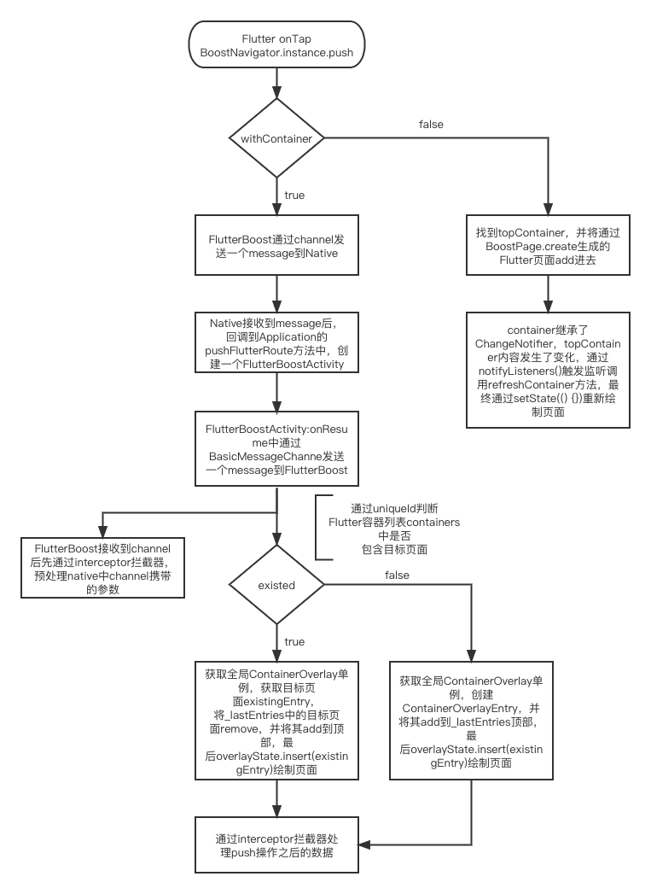

## 一期分享问题总结：
1、内部路由的跳转是否基于Overlay, Overlay是否是复用一个还是多个？

FlutterBoost内部复用一个Overlay，通过单例获取全局唯一一个Overlay。

2、Flutter boost 从点击到完成整个跳转的详细交互图

3、整理工作端和Flutter boost的改造方案

目前方案是通过FlutterBoost提供的统一的路由channel，通过channel将路由协议push到Native端的Application中统一解析处理，
后续会产出一个Demo，整理出一套便于商家版和工作端统一的路由解析处理方案。
