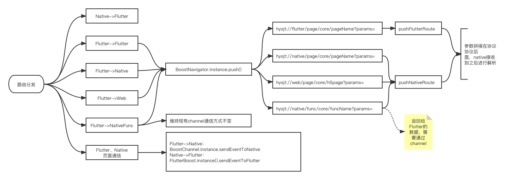

## 二期分享问题总结：
1、页面跳转路由和Native侧方法调用是否可以整合到一套路由协议内？

2、页面跳转路由如何参数拼接才能便于统一处理？
具体看业务如何解析路由
3、打开多个Flutter页面，在不关闭当前页面的前提下，能不能做到主动刷新之前的页面？
3.1Flutter页面跳转Native页面，在Native页面关闭前主动刷新Flutter页面【BoostChannel.instance.sendEventToNative】
3.2Native页面跳转Flutter页面，在Flutter页面关闭前主动刷新Native页面【FlutterBoost.instance().sendEventToFlutter】
3.3Flutter页面跳转Flutter页面，在当前Flutter页面关闭前主动刷新之前的Flutter页面【通过redux里面的event事件机制，当前Flutter页面主动触发事件，之前的Flutter页面接收到事件后进行刷新】

sendEventToNative、sendEventToFlutter本质是FlutterBoost封装好了一个channel，通过这个channel触发一个监听事件，不支持Flutter向Flutter发送。

