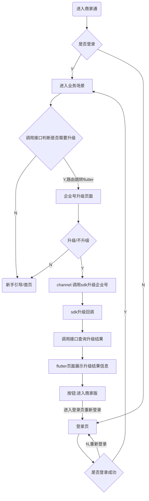

# Merchantplatform

## 项目简介
> 58同城商家版是针对B端黄页的商家用户的APP


### 工程中各个模块简介

#### app
app 是主要页面和代码逻辑所在的地方。

#### librarys
是通用代码库，工具，组建的包，一些基础功所在。

#### zhaobiao
是最开始商家通的功能，目前很多都不再使用。

#### WRTCKit
微聊中视频和语音通话库

#### HYRN
接入的RN发布

#### saas
家庭服务四方服务

#### tripartiteSaas
家庭服务三方服务

#### HRouter
路由分发管理

#### RouterProcessor
编译时注解处理器

#### RouterManager
占位类

#### RouterAnnotation
路由注解


## 规范

### 编码规范：

>   * 对自己的代码有点追求，不要一点原则都没有的堆砌逻辑，
>   * 多想想怎样实现更合理，代码更简洁易懂，更规范
>   * 如何提高复用率和个人效率
>   * 做需求一定不要只看自己做的那点功能，一定要从整体考虑。


### 图片
> 图片的命名


### 路由

> 路由定义编辑地址 http://protocol.58corp.com/protocol/list?category_id=139&child_id=140&page=1

### 页面


## 开发
* host

    ```
    # 开发host

    # 后端host，注：后端ip不固定，每次需求需要跟rd确认

    ```
* 命令

    ```
    npm run dev
    ```
* 访问：[http:dev.58.com:8089](http:dev.58.com:8089)

## 测试
* host
    ```

    ```
* 命令

    ```

    ```

* 提测：
  * ici新建版本流打包测试
  * ici地址:http://ici.58corp.com/product-data/version-list?prodId=26 (首次需要权限配置找相关项目负责人)
  * 提测后，QA会把bug提到iwork里，同时也会收到对应的邮件（注：会有收不到的情况，及时关注iwork），尽量当前bug当前清，修改bug后及时更改相应的状态。


## 上线
> 需要到ici构建集成包，集成包构建成功之后，去发布管理中构建渠道包。
> 渠道包获取地址 http://10.167.200.26/shangjiatong/ 后面会加版本好例如 2.3 再加一个时间戳 例如：http://10.167.200.26/shangjiatong/2.3/210910150002/
> 但是这个地址是内网的，外网的CDN地址需要加上特定的域名 http://dl.58cdn.com.cn/shangjiatong/www/
> 例如：http://dl.58cdn.com.cn/shangjiatong/www/shangjiatong/2.3/210910150002/2.3_shangjiatong_hy_release_hy.apk


## 迭代
### 2.4
> 上线时间：2021-09-17

#### 需求地址

* 【商家版】接入企业号：https://iwork.58corp.com/v4/issue/detail/SHANGJT-3442
* 【发布】接入RN版发布:https://iwork.58corp.com/v4/issue/detail/SHANGJT-3250
* 【SDK】android需要接入最新的登录SDK、微聊SDK以保证兼容:https://iwork.58corp.com/v4/issue/detail/SHANGJT-3402
* 【家服】点击底部TAB刷新页面 https://iwork.58corp.com/v4/issue/detail/SHANGJT-3437
* 【家服】首页增加经纪人打卡功能 https://iwork.58corp.com/v4/issue/detail/SHANGJT-3436
* 分享组件同时支持微信好友、微信朋友圈、微信小程序、复制链接 https://iwork.58corp.com/v4/issue/detail/SHANGJT-3409
* 【商服】商服拉新融入新用户引导 https://iwork.58corp.com/v4/issue/detail/SHANGJT-3444

#### UI地址

* https://hotwheel.58.com/project/28ad36a8-3ff5-41c7-ae2c-698968434302
* https://hotwheel.58.com/project/8a98d923-8ffb-4dae-9a4f-1650f60f689d
* https://hotwheel.58.com/project/106f8850-0d51-4d03-be5e-1e117d5971fb

### 2.5
> 上线时间：2021-10-17

#### 需求地址

* 【经营小助手】:https://ee.58corp.com/detail/iwork/v4/issue/detail/SHANGJT-3467
* 【成长页面顶部位置样式调整】:https://ee.58corp.com/detail/iwork/v4/issue/detail/SHANGJT-3470
* 【合规问题补全】:https://ee.58corp.com/detail/iwork/v4/issue/detail/SHANGJT-3469
* 【消息中心】修复首页右上角小红点: https://ee.58corp.com/detail/iwork/v4/issue/detail/SHANGJT-3455
*  在首页增加转介绍入口 :https://ee.58corp.com/detail/iwork/v4/issue/detail/SHANGJT-3471
* 【帖子】增加「天天展位」的展示状态 :https://ee.58corp.com/detail/iwork/v4/issue/detail/SHANGJT-3452
*  账号注销 :https://ee.58corp.com/detail/iwork/v4/issue/detail/SHANGJT-3468

#### UI地址

* https://hotwheel.58.com/project/7977bef5-535c-4f4b-8112-6760160bc4d0
* https://hotwheel.58.com/project/b7bf761e-4135-4682-8de4-6474874d4c4a


### 2.6
> 上线时间：2021-11-05

#### 需求地址

* 【家服】家政员模块顶部标题栏支持tab切换:https://ee.58corp.com/detail/iwork/v4/issue/detail/SHANGJT-3487
* 【家服】首页CRM关键数据指标:https://ee.58corp.com/detail/iwork/v4/issue/detail/SHANGJT-3498
* 【数据看板】位置调整:https://ee.58corp.com/detail/iwork/v4/issue/detail/SHANGJT-3496
* 【帖子】黄页帖子管理1.0: https://ee.58corp.com/detail/iwork/v4/issue/detail/SHANGJT-3481
* 【发布】商家版接入RN发布二期:https://ee.58corp.com/detail/iwork/v4/issue/detail/SHANGJT-3476


#### UI地址

* https://hotwheel.58.com/project/dcd2c5b9-1c22-4fc7-984a-e604da46b9ab
* https://hotwheel.58.com/detail/d5578d39-29e8-4b65-b83f-b98fc54b3a45
* https://hotwheel.58.com/project/f0053021-4a81-49b4-94b2-449943f666e1
* https://hotwheel.58.com/project/b858cd96-b58a-429a-8cf9-f9201ab73be2


### 2.7
> 上线时间：2021-12-10

#### 需求地址

* 完善web容器返回协议:https://ee.58corp.com/detail/iwork/v4/issue/detail/SHANGJT-3522
* 【经营台】更改首页转介绍入口图片:https://ee.58corp.com/detail/iwork/v4/issue/detail/SHANGJT-3524
* 【家庭服务】首页埋点:https://ee.58corp.com/detail/iwork/v4/issue/detail/SHANGJT-3514
* 【埋点修复】经营小助手:https://ee.58corp.com/detail/iwork/v4/issue/detail/SHANGJT-3513
* 【企业号】升级企业号:https://ee.58corp.com/detail/iwork/v4/issue/detail/SHANGJT-3509
* 【企业号】邀请成员加入:https://ee.58corp.com/detail/iwork/v4/issue/detail/SHANGJT-3510
* 【企业号】切换账号及业务:https://ee.58corp.com/detail/iwork/v4/issue/detail/SHANGJT-3511
* 【企业号】子账号管理及权限:https://ee.58corp.com/detail/iwork/v4/issue/detail/SHANGJT-3502
* 【推广】下线开屏广告:https://ee.58corp.com/detail/iwork/v4/issue/detail/SHANGJT-3500

#### UI地址

* https://hotwheel.58.com/project/b858cd96-b58a-429a-8cf9-f9201ab73be2
* https://hotwheel.58.com/project/ea321967-634d-49f0-88ae-b7d3488a3d37

#### 业务功能说明

* js交互协议新增setWebReturnParams、createSubBingToken、removeSubEnterprise，详情查看[iwiki](http://iwiki.58corp.com/wiki/lbg/view/%E9%83%A8%E9%97%A8/%E6%97%A0%E7%BA%BF%E6%8A%80%E6%9C%AF%E9%83%A8/08%E3%80%81%E5%95%86%E5%AE%B6%E9%80%9AAPP/7%E3%80%81%E6%8E%A5%E5%8F%A3%E8%A7%84%E8%8C%83%E5%8F%8A%E5%88%97%E8%A1%A8/1%E3%80%81%E5%95%86%E5%AE%B6%E9%80%9Ajsbridge%E6%8E%A5%E5%8F%A3%E8%AF%B4%E6%98%8E/)
* 企业号功能在2.7版本只针对商家版，且用户登录和APP每次启动进入商家版都会经过`AdUtil.AdJump(activity)`这个业务起点方法，所以企业号升级功能写在此处最为合适。



* 企业号权限由后台服务下发，涉及到的具体页面和功能可查看[需求文档](https://ee.58corp.com/detail/iwork/v4/issue/detail/SHANGJT-3502)和[权限表](https://docs.qq.com/sheet/DQXdFWEhKVW5QTWJO)

    权限控制统一管理类：`AuthCheckUtils`，flutter页面调用channel`authCheck`即可。

* 【企业号】切换账号，路由：`PageRouterConstants.FUNCTION_SWITCH_ENTERPRISE`。
* 【企业号】添加新成员，js交互协议：`createSubBindToken`，目前逻辑为先调用sdk创建子账号获取userName，再调用sdk生成绑定token。（ps：sdk后期优化-提供直接获取绑定token的方法）
* 【企业号】操作离职，js交互协议：`removeSubEnterprise`，由FE提供参数，Native调用sdk。
* 【企业号】退出该企业，设置页面添加退出企业入口，调用接口查询当前B子账号绑定的cUserName，然后调用sdk退出企业。


### 3.4
> 上线时间：2022-05-30

#### 需求地址
* 后端支持：
* 微聊代运营banner：文涛
* 新用户引导：文涛
* 视频四期素材选择：曲鑫亮   13号下班前开发完成，16号一早可以开始联调，中台16号提测，20号随app一起提测
* 家服首页：张波  5/16联调
* 视频四期：发布的一键成片入口的权限判断  5/20联调

* iWork需求地址：https://ee.58corp.com/w/sprint/403559
* 任务拆分文档：https://docs.qq.com/sheet/DUFJtS1FFcWZYU0pU?u=b954a5f297c146b8ad57d8ba0e472bdd&tab=BB08J2
* 接口协议文档：http://lbgapi.58corp.com/#/space/project/5PzmK8Jv
* 各方依赖关系及排期表:https://docs.qq.com/sheet/DT1ZwYkZrdWNaSkNr?u=b954a5f297c146b8ad57d8ba0e472bdd&tab=demh9y

#### UI地址
* 商家：
* 素材选择UI：https://hotwheel.58.com/project/ab67028a-7426-46cb-93b1-59575690412b
* 新用户引导4.0：https://hotwheel.58.com/project/63ae4d8b-b299-4d5b-be44-71a0a43c59a7

* 家服：
* 首页：https://hotwheel.58.com/project/4e1b4c9f-cec1-4a74-992a-8f173d22465a
